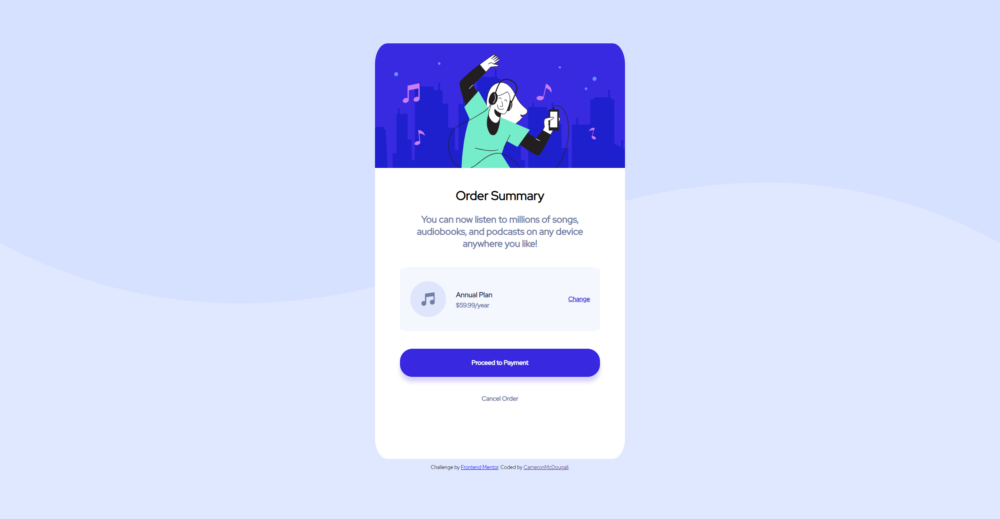

# Frontend Mentor - Order summary card solution

This is a solution to the [Order summary card challenge on Frontend Mentor](https://www.frontendmentor.io/challenges/order-summary-component-QlPmajDUj). Frontend Mentor challenges help you improve your coding skills by building realistic projects. 

## Table of contents

- [Overview](#overview)
  - [The challenge](#the-challenge)
  - [Screenshot](#screenshot)
  - [Links](#links)
- [My process](#my-process)
  - [Built with](#built-with)
  - [What I learned](#what-i-learned)
  - [Useful resources](#useful-resources)

## Overview

### The challenge

Users should be able to:

- See hover states for interactive elements

### Screenshot




### Links

- Solution URL: [Solution](https://github.com/CameronMcDougall/order-summary-component-main-/)
- Live Site URL: [Live Solution](https://cameronmcdougall.github.io/order-summary-component-main-/)

## My process

### Built with

- HTML
- CSS
- Flexbox
- Mobile-first workflow

### What I learned

Use this section to recap over some of your major learnings while working through this project. Writing these out and providing code samples of areas you want to highlight is a great way to reinforce your own knowledge.

Mobile first design.

```css
body {
    background-image: url(../images/pattern-background-mobile.svg);
    background-repeat: no-repeat;
    background-size: 100%;
    background-position: fixed;
    background-color: hsl(225, 100%, 94%);
}

html, body {
    margin: 0; 
    height: 100%;
    overflow: hidden
}

@media only screen and (min-width: 767px) {
    body {
        background-image: url(../images/pattern-background-desktop.svg);        
    }
}
```
### Useful resources

- [Mobile First resource](https://www.donnywals.com/mobile-first-is-a-great-workflow/)

